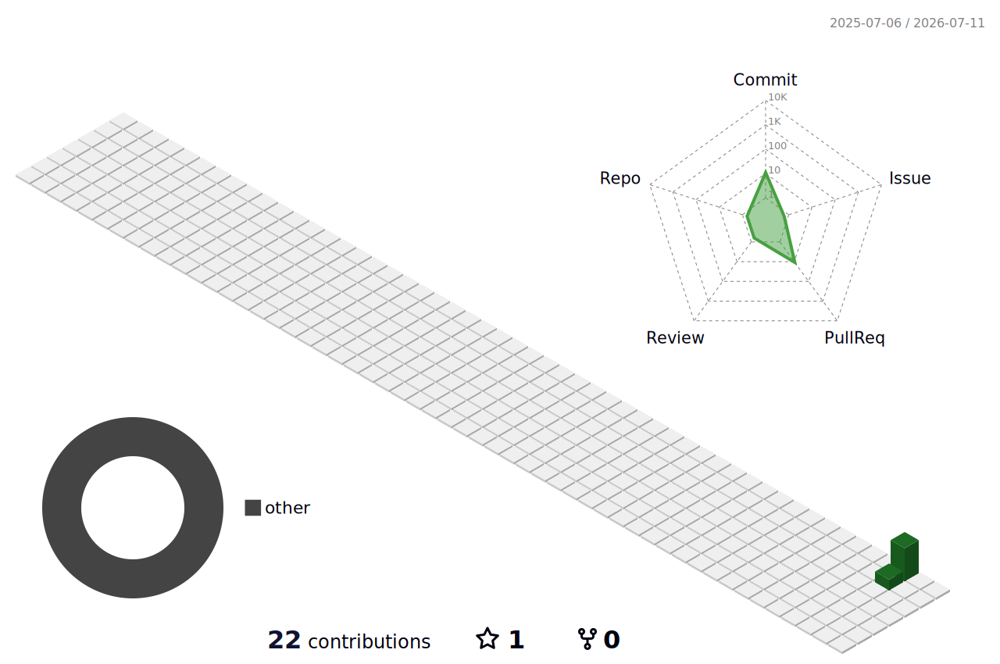

<!-- HEADER / BANNER -->


<div align="center">

  

  <p>
    
    <a href="https://github.com/vuthysreang?tab=followers"></a>
  </p>

</div>

---

<!-- ABOUT ME -->
## 🌿 About Me

<p><i>Experienced Full-Stack web developer with a passion for all aspects of the software development life cycle. Proven team collaborator and a self-managing individual for independent projects.</i></p>

- 🔭 I’m currently working on **full-stack web applications**
- 🌱 I’m currently learning **🤫 ...**
- 💬 Ask me about **Front-End, Back-End, APIs, Databases & DevOps**
- ⚡ Fun fact: **I think I'm funny 😎**

📫 **Reach me:** [vuthysreang.zevo@gmail.com](mailto:vuthysreang.zevo@gmail.com) &nbsp;•&nbsp; 📞 [+855 98 820 725](tel:+85598820725) &nbsp;•&nbsp; 📞 [+855 77 768 478](tel:+85577768478)

📄 **Experience:** [Vuthy SREANG on LinkedIn](https://www.linkedin.com/in/vuthy-sreang/)

<div align="center">
  <h3>🌲 <i>Build · Learn · Repeat</i> 🌱</h3>
</div>

---

<!-- CONNECT WITH ME -->
## 🤝 Connect with me

<p align="left">
  <a href="https://linkedin.com/in/vuthy-sreang" target="_blank">
    
  </a>
  <a href="https://www.facebook.com/VuthySREANG.me/" target="_blank">
    
  </a>
  <a href="mailto:vuthysreang.zevo@gmail.com" target="_blank">
    
  </a>
</p>

---

<!-- LANGUAGES, FRAMEWORKS & TOOLS -->
## 🌲 Languages, Frameworks & Tools

```ts
const vuthy = {
  role: "Full-Stack Web Developer",
  code: ["TypeScript", "JavaScript", "Java", "Python"],
  builds: ["React", "Next.js", "Vue", "Node.js", "NestJS", "Spring Boot"],
  learning: "leveling up in stealth mode 🥷",
};
```

> 🌿 _Click any badge to open its official website._

**🌱 Languages**

[](https://developer.mozilla.org/en-US/docs/Web/HTML)
[](https://developer.mozilla.org/en-US/docs/Web/CSS)
[](https://developer.mozilla.org/en-US/docs/Web/JavaScript)
[](https://www.typescriptlang.org/)
[](https://www.java.com/)
[](https://www.python.org/)

**🍃 Front-End**

[](https://react.dev/)
[](https://nextjs.org/)
[](https://vuejs.org/)
[](https://nuxt.com/)
[](https://angular.dev/)
[](https://tailwindcss.com/)

**🌳 Back-End**

[](https://nodejs.org/)
[](https://expressjs.com/)
[](https://nestjs.com/)
[](https://spring.io/projects/spring-boot)

**🌴 Databases & Messaging**

[](https://www.mongodb.com/)
[](https://www.postgresql.org/)
[](https://www.mysql.com/)
[](https://www.microsoft.com/en-us/sql-server)
[](https://redis.io/)
[](https://www.rabbitmq.com/)

**🪴 DevOps & Tools**

[](https://www.docker.com/)
[](https://www.linux.org/)
[](https://git-scm.com/)
[](https://www.gnu.org/software/bash/)
[](https://www.zsh.org/)
[](https://www.postman.com/)
[](https://code.visualstudio.com/)
[](https://www.figma.com/)

**🤖 AI Tools**

<table align="center">
  <tr>
    <td align="center" width="160">
      <a href="https://claude.ai/" target="_blank" title="Claude">
        
      </a>
      <br/><b>Claude</b>
      <br/><sub>AI pair-programmer</sub>
    </td>
    <td align="center" width="160">
      <a href="https://openai.com/codex/" target="_blank" title="OpenAI Codex">
        <picture>
          <source media="(prefers-color-scheme: dark)" srcset="https://cdn.jsdelivr.net/npm/@lobehub/icons-static-png@latest/dark/openai.png" />
          
        </picture>
      </a>
      <br/><b>Codex</b>
      <br/><sub>OpenAI coding agent</sub>
    </td>
    <td align="center" width="160">
      <a href="https://antigravity.google/" target="_blank" title="Gemini Antigravity">
        
      </a>
      <br/><b>Gemini Antigravity</b>
      <br/><sub>Agentic IDE</sub>
    </td>
    <td align="center" width="160">
      <a href="https://notebooklm.google.com/" target="_blank" title="NotebookLM">
        
      </a>
      <br/><b>NotebookLM</b>
      <br/><sub>AI research notebook</sub>
    </td>
  </tr>
</table>

---

<!-- GITHUB STATS -->
## 📊 My GitHub Stats

<div align="center">

  
  

  <br/>

  

  <br/>

  

  <br/>

  <!-- 3D contribution calendar — generated by .github/workflows/profile-3d.yml (committed to main) -->
  <picture>
    <source media="(prefers-color-scheme: dark)" srcset="./profile-3d-contrib/profile-night-green.svg" />
    <source media="(prefers-color-scheme: light)" srcset="./profile-3d-contrib/profile-green-animate.svg" />
    
  </picture>

</div>

---

<div align="center">

  

  <i>🌲 From <a href="https://github.com/vuthysreang">Vuthy SREANG</a> — let's grow something great together!</i>

</div>
